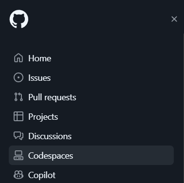
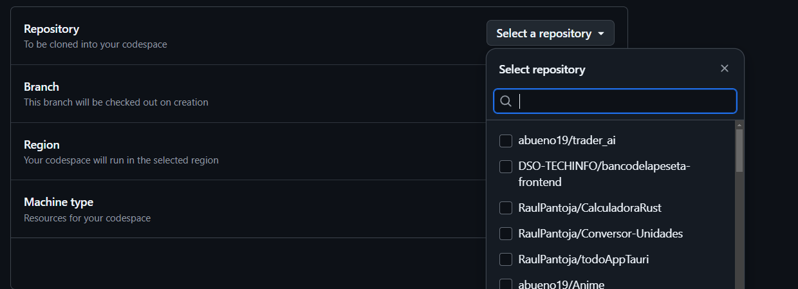
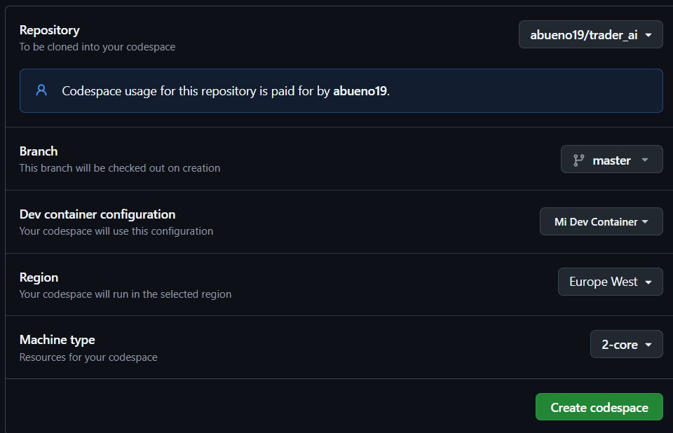

# Bot de trading 

## Objetivos
Vamos a crear un bot de trading con el objetico de generar ingresos pasivos todos los meses apartir de una inversion 
Los ingresos pasivos seran proporcionales a la cantidad de inversion

## Requisitos Minimos
1. Integracion con brokers (Metatrader, Binance, Bitmex, etc) <span style="color:gray">1 Obligatorio</span>
2. Integracion con fuentes de datos (Yahoo Finance, Google Finance, etc) <span style="color:gray">1 Obligatorio</span>
3. Trading automatizado usando una ia RL con IAs de auxiliares
4. Integracion con IAs de auxiliares para mejorar la prediccion de la IA principal
5. Datos de la IA auxiliar para saber tendencias.
6. Autoajuste de riesgo y apalancamiento
7. Ajuste automatico de cantidad de inversion, take profit y stop loss
8. Visualizacion de resultados y estadisticas
9. Backtesting de la IA principal y de las IAs auxiliares
10. Trading en multiples timeframes (short, medium, long)

## Requisitos Opcionales
1. Multiples estrategias de trading
2. Visualizacion de graficos en tiempo real via web
3. Sistema de notificaciones via Telegram, Whatsapp, Email, etc
4. Trading en multiples mercados
5. Sistema de lectura de noticias para tomar decisiones
6. Uso de IA chatgpt en ciertas ocasisones para ayudar a tomar decisiones

### Guia de intalación

#### Instalación local
1. Clonar el repositorio
```bash
git clone https://github.com/abueno19/trader_ai
```
2. Instalar las dependencias
```bash
pip install -r requirements.txt
```
3. Ejecutar el bot
```bash
python main.py
```

#### Instalación en la nube (codespaces)

1. Accedemos a nuestro perfil de github
2. Vamos a la pestaña de codespaces



3. Vamos a dar al boton de nuevo codespace


4. Seleccionamos el repositorio



5. Deberiamos tener un menu parecido a este 



## Contribuciones
Cualquier contribucion es bienvenida, si quieres contribuir sigue los siguientes

## Autores
- abueno19


 
